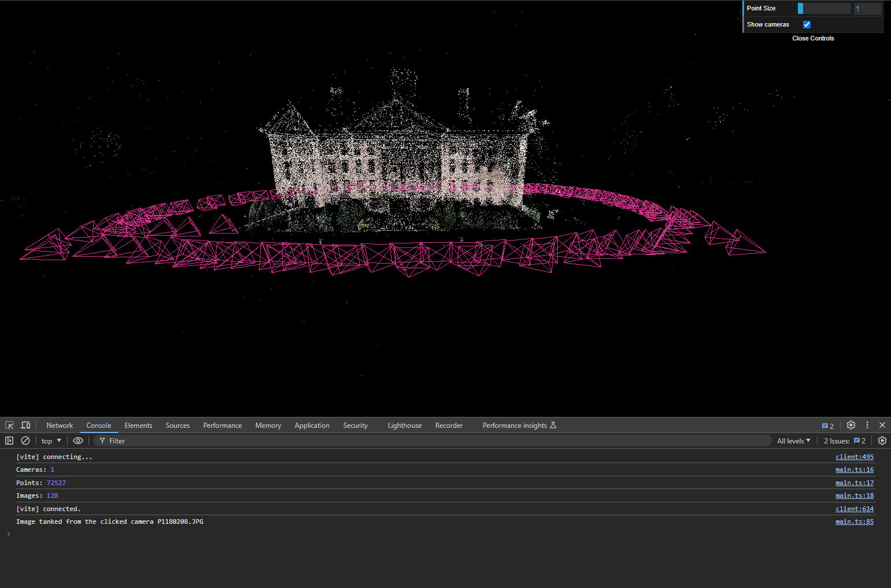

# COLMAP .bin point cloud loader for THREE.JS

This is javascript/three.js adoption of the python .bin reader (https://github.com/colmap/colmap/blob/main/scripts/python/read_write_model.py)

- COLMAP documentation - https://colmap.github.io/
- Sample files can be downloaded from https://demuc.de/colmap/datasets/
- Convert sample sparse/*.txt files to bin with `colmap model_converter` cli tool.

### Usage:
Check *examples/bin-loader*.